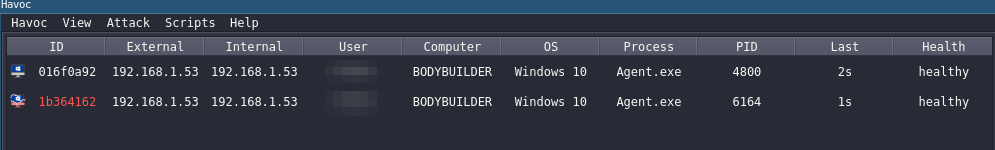

# Havoc_impersonnate

Havoc impersonnate module integrate impersonnate directly in havoc.

The script take 3 binarie file. 2 files was copy paste of object file in NoConsoolation module. the last file is Ditto.exe, that impersonnate file. Thanks to @LeDocteurDesBits (https://github.com/LeDocteurDesBits/Ditto) for his repo.

The module can upload ditto.exe (or other file) on victime or Launch executable directly in memory.

# Installation

1. Install python dependecie.
```
pip install argparse 
```

2. Clone the repo
```
git clone https://github.com/MaldExE/Havoc_impersonnate.git
```

After clone. Go on your Havoc client.

3. Click on script tab and open script manager window.



4. Click Load Script choose impersonnate.py and open it


One line appears in script manager tab.

The Script was load in havoc

# Using guide


